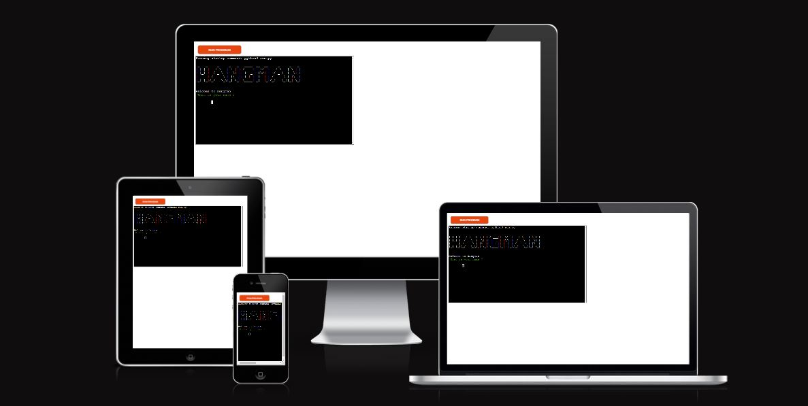
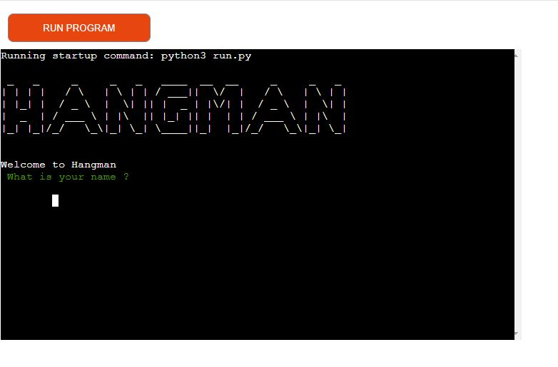
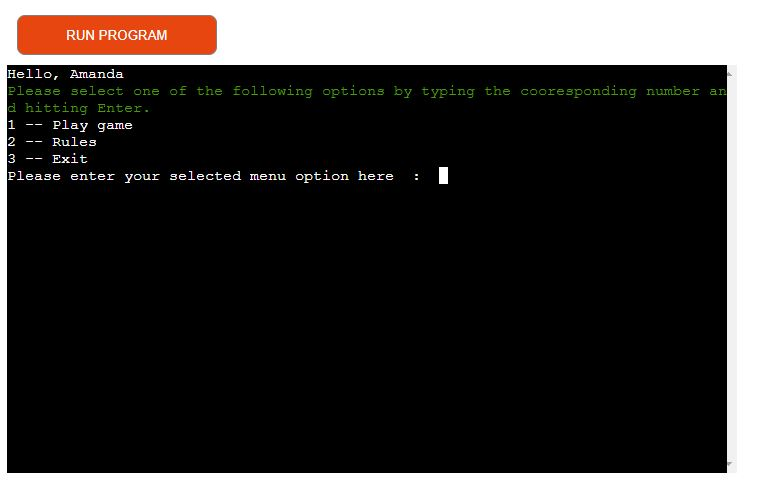
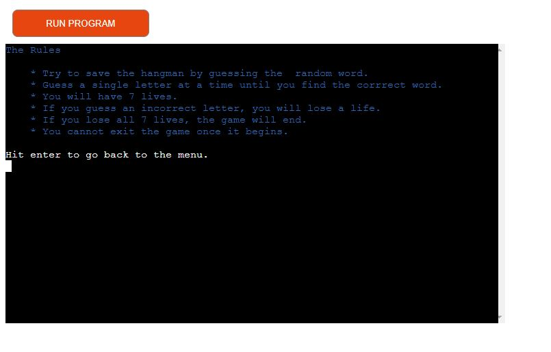
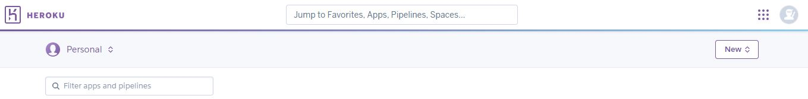
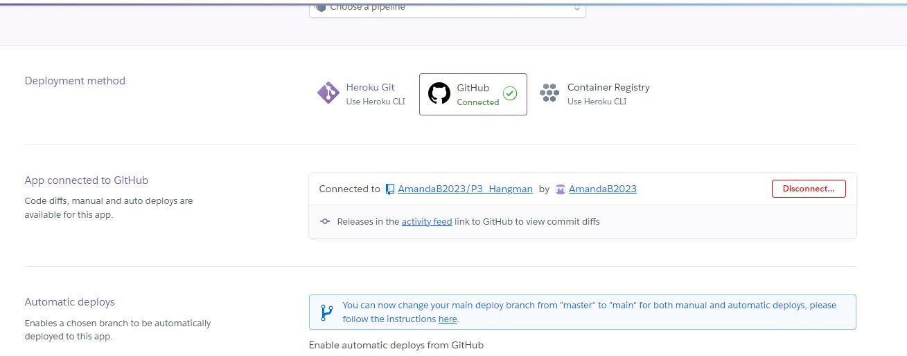
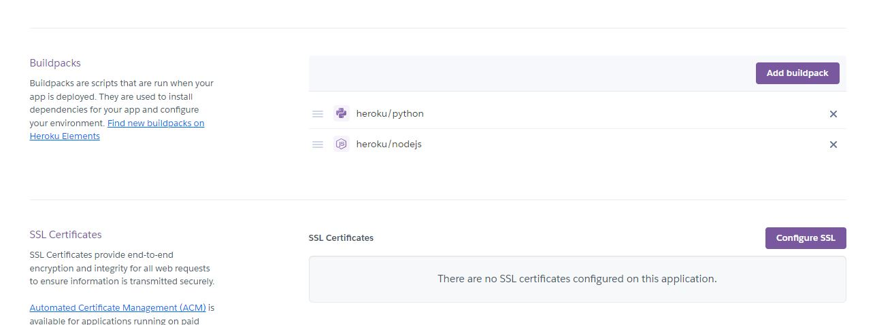
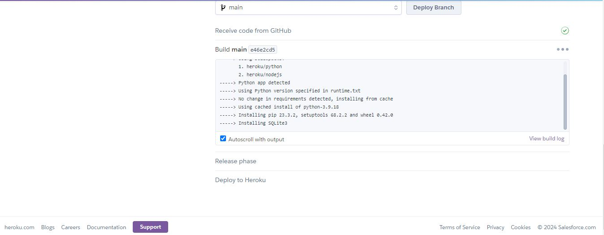

# Hangman

Hangman is a terminal game based on the classic word game Hangman.

* The link to [Hangman](https://af-project-3-hangman-ab624bdbed0d.herokuapp.com/)

## How to play

*   Click on this link (https://af-project-3-hangman-ab624bdbed0d.herokuapp.com/) or copy and paste to browser.
*   As soon as the page loads enter your name.
*   Select one of the options from the menu.
*   Learn the rules
*   Start the game.

## User Stories
  As a user:
*    I want to be able to enter my name and get feedback if I have entered it incorrectly.
*   I want to be able to view the rules of the game.
*   I want to be able to see how many letters I need to guess.
*   I want to be able to see what letter I have already guessed.
*   I want to be notified if I select something other than a letter.
*   I want to be notified if I have already guessed a certain letter.
*    I want to know how many lives or guesses I have left.
*   I want a picture so I can visualise how many lives or guesses I have left.
*   I want to be able to restart the game without having to exit first.

## Features

### Welcome Screen
The welcome screen has a large hangman logo to show the user what game they are playing.
The user is then welcomed to the game via a welcome message and asked to enter their name.

After entering their name the user is then welcomed by name.

### Main Menu 
The user is then presented with a menu from which they can select one of three options :

1. Play the game.
2. See the Rules.
3. Exit game.

#### Play the Game 
If the user selects to play the game they are presented with a statement informing them of how many lives they have and what letters they have already used. They will also be presented with a graphic that will change everytime the user loses a life.
The user will be shown lines to indicate how many letters in length the current word is, which they have to guess. They will then be asked to input a letter and press enter.

If the user enters a letter that is not in the current word, they will be told Sooy but your chosen letter is not in the word, followed by the number of lives they have left and the letters used. The graphic will also be updated to reflect this.

If the user fails to select a correct letter then the game will come to an end.

If the user guesses the word they will be congratulated and asked if they would like to play again, here they can either select Y to play again or hit any other key to exit where they will receive a goodbye message.

#### The Rules
if the user selects to view the rules they will be presented with a list of rules and told to click enter, to return to the main menu.

#### Exit
If the user selects to exit the game they will be presented with a goodbye message.

## Technologies Used
The following technologies were used to complete this project.

*   Python - was used to write the program.
*   HTML - was used to build that mock terminal.
*   Javascript - was used to provide the start-up script to run the Code Institute terminal.
*   [GitHub](https://github.com/) was used to host the project code after being pushed.
*   Git - was used for the version control of the website.
*   Heroku - was used to deploy the project.
*   VS Code - was used to write and edit code for the project.

### Imported Libraries 
*   random - was used to randomly select a word for the user to play from the list of words in the words.py file.
*   os - was used to clear the terminal to make for a better user experience by reducing clutter on the screen.
*   Colorama - was used to add some color to the project and make it more aesthetically pleasing for the user.

## Bugs 
## Testing 
## Deployment

The project was deployed to Heroku

### To deploy the project as an application that can be run locally

You must first have Python installed 

*   Download  Zip File

Go to the GitHub Repo page.
Click the Code button and download the ZIP file containing the project.
Extract the ZIP file to a location on your PC.

*   Clone Repository

In order to make a local copy of this project, you can clone 
it. 

Sign in to GitHub, locate the repository and click to open the repository.

On the repository main page, click the green code button where the files are located.

This will open a drop - menu.

In the dropdown menu stay on the HTTPS option and click the copy icon button next to the URL to copy it.

Next open Git Bash and type git clone and your directory link.#

Then type cd and the directory name.

Then code . to open VS Studio using Windows.

### To deploy on Heroku

Clone the repository as above.

Create Heroku account here

Create a new Heroku application by clicking creat new app.

Go to deploy tab.

Link your Github account

Go to settings and add buildpack.

Add Python and Node.js in that order.

Go to the Deploy tab and select deploy from branch.

Wait for completion and click view.

## Credits
Color formatting: [Colorama](https://pypi.org/project/colorama/).

## Acknowledgements
