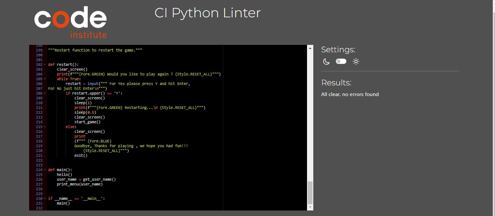
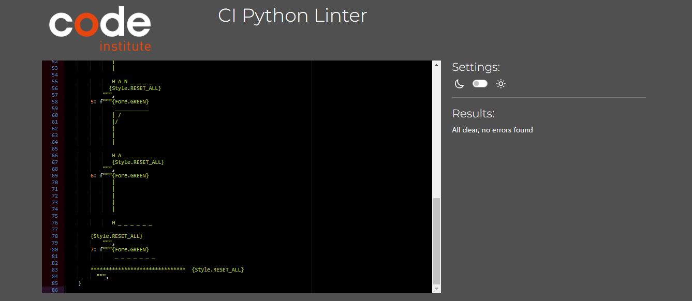
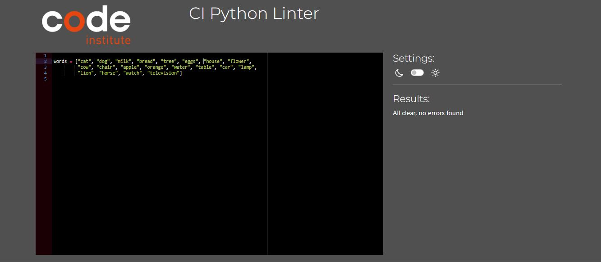

# Testing

This project was continuously tested throughout the develpment stage. It was also tested by a number of other people prior to submisssion.

## Validator

The code used in this project was validated thought the Code Institute CI Python Linter [Code Institute Linter](https://pep8ci.herokuapp.com/) 

No error were found.

*   run.py

*   hangman_visual.py

*   words.py

## Program Validation Testing

| Section Tested | Input To Validate | Expected Outcome |  Pass/Fail |
| -------------- | ----------------- | ---------------- |  --------- |
| What is your name | User enters name | User gets responce Hello ( User Name) |Pass|
| Menu |User selects  option 1|User is brought to the game |Pass
| |User selects  Option 2 Play |user is brought to the Rules ||Pass
| |User selects  Option 3 exit |the game is exited|Pass
|Play Game | User enters letter |if letter correct letter appears in word on screen|Pass
|||If letter incorrect message sent to user|Pass
|||If no letter inputed , warning message sent to user|Pass
|||If letter already guessed, uer is notified.
|Play Again| User enters Y for Yes | Game starts again|Pass
||User enters any other key or presses enter| Game ends|Pass
|Rules| User presses enter| User is retured to menu |Pass
|Exit| User selects exit| Game is exited|Pass

